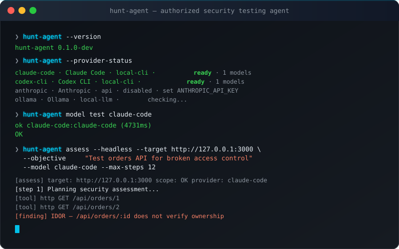

<div align="center">



# Hunt-agent

**Your AI security agent. Your models. Your tools.**

[](LICENSE)
[](https://nodejs.org)
[](https://www.typescriptlang.org)
[](#testing)
[](#providers)
[](CONTRIBUTING.md)

```
Hunt-agent  ·  open-source AI agent for authorized security testing
```



</div>

---

> **For authorized security testing only.**  
> Hunt-agent must only be used against targets you own or have explicit written permission to test.  
> Do not use against production systems without authorization. See [SECURITY.md](SECURITY.md).

---

## What is Hunt-agent?

Hunt-agent is an open-source, privacy-first AI security testing agent that runs entirely on your machine. It connects to whatever AI models you already have — local CLIs like [Claude Code](https://claude.ai/download) and [Codex CLI](https://github.com/openai/codex), local LLMs via Ollama or LM Studio, or API providers like OpenAI, Anthropic, and OpenRouter — and uses them to drive an autonomous security assessment workflow.

Unlike cloud-based security tools, Hunt-agent:
- **Runs locally** — your target data and session history never leave your machine unless you configure an API provider
- **Works with your models** — Claude Code, Codex CLI, Ollama, LM Studio, or any OpenAI-compatible endpoint
- **Enforces scope** — a `scope.yaml` file defines exactly what can be tested; out-of-scope requests are blocked at the tool level
- **Keeps humans in the loop** — risky actions (shell commands, file writes, active scans) require approval unless you explicitly disable that
- **Produces evidence-backed findings** — no theoretical bugs; every confirmed finding needs captured evidence before it's written to disk

---

## Verified results

Both local CLI providers tested and confirmed working:

| Provider | Version | Status | Test result |
|---|---|---|---|
| **Claude Code** | 2.1.165 | ✅ Fully verified | `ok claude-code:claude-code (4731ms)` |
| **Codex CLI** | 0.135.0 | ✅ Fully verified | `ok codex-cli:codex-cli (10688ms)` |
| Ollama | — | ⏭ Skip if not running | clean skip with `ollama serve` hint |
| OpenAI API | — | 🔑 Needs `OPENAI_API_KEY` | — |
| Anthropic API | — | 🔑 Needs `ANTHROPIC_API_KEY` | — |
| OpenRouter | — | 🔑 Needs `OPENROUTER_API_KEY` | — |

---

## Table of Contents

- [Install](#install)
- [Quickstart](#quickstart)
- [Providers](#providers)
  - [Claude Code](#claude-code-provider)
  - [Codex CLI](#codex-cli-provider)
  - [Ollama](#ollama-provider)
  - [API providers](#api-providers)
- [Model routing](#model-routing)
- [Scope policy](#scope-policy)
- [Headless assessment mode](#headless-assessment-mode)
- [Report generation](#report-generation)
- [Evidence graph](#evidence-graph)
- [Session replay](#session-replay)
- [Local dashboard](#local-dashboard)
- [Onboarding](#onboarding-hunt-agent-init)
- [Skills](#skills)
- [Local benchmark fixtures](#local-benchmark-fixtures)
- [Multi-agent verification](#multi-agent-verification)
- [Security model](#security-model)
- [Development](#development)
- [Testing](#testing)
- [Architecture](#architecture)
- [Migrating from pentesterflow](#migrating-from-pentesterflow)
- [Contributing](#contributing)
- [License](#license)

---

## Install

### From source (works today)

```bash
git clone https://github.com/momenbuilds/Hunt-agent.git
cd Hunt-agent
npm install
npm run build
npm link            # installs hunt-agent and hunt globally
hunt-agent --version
# → hunt-agent 0.1.0-dev
```

### Via npm (once published)

```bash
npm install -g @hunt-agent/cli
hunt-agent --version
```

### Via curl installer (once GitHub releases are published)

```bash
curl -fsSL https://raw.githubusercontent.com/momenbuilds/Hunt-agent/main/install.sh | sh
```

> The curl installer requires a tagged GitHub release with pre-built binaries. Use source install today.

### Requirements

- Node.js ≥ 20
- One of: Claude Code, Codex CLI, Ollama, or an API key for a supported provider

---

## Quickstart

```bash
# 1. Check what providers you have installed
hunt-agent --provider-status

# 2. Initialize a new workspace
hunt-agent init --provider claude-code --target http://127.0.0.1:3000

# 3. Validate your scope file
hunt-agent scope validate scope.yaml

# 4. Verify your provider is working
hunt-agent model test claude-code

# 5. Launch the interactive TUI
hunt-agent

# — or run headlessly in CI —
hunt-agent assess --headless \
  --target http://127.0.0.1:3000 \
  --objective "Check the orders API for broken access control" \
  --model claude-code \
  --max-steps 12
```

---

## Providers

Hunt-agent supports four categories of model providers:

| Kind | Examples | Notes |
|---|---|---|
| `local-cli` | Claude Code, Codex CLI | Official CLIs you install + auth yourself |
| `local-llm` | Ollama, LM Studio, llama.cpp | OpenAI-compatible local servers |
| `openai-compatible` | OpenRouter, Groq, Kimi, DeepSeek, Fireworks | OpenAI API wire format |
| `api` | OpenAI, Anthropic, Gemini | Native API clients |

```bash
hunt-agent --provider-status      # show all providers
hunt-agent --list-providers       # compact list
hunt-agent --list-models          # all available models
hunt-agent provider add ollama    # write provider config entry
```

### Claude Code provider

Hunt-agent uses the official `claude` CLI (non-interactive print mode: `claude -p`).

```bash
# Install Claude Code
# → https://claude.ai/download

# Authenticate (one-time, through official flow)
claude

# Hunt-agent will auto-detect it
hunt-agent --provider-status | grep claude-code
# → claude-code · Claude Code · local-cli · ready
```

**What Hunt-agent does NOT do with Claude Code:**
- Does not read `~/.claude/` OAuth files
- Does not read browser cookies or keychain entries
- Does not proxy Claude.ai subscription credentials
- Only calls `claude -p "<prompt>"` as an external process

**Verified result:** `ok claude-code:claude-code (4731ms)` ✅

### Codex CLI provider

Hunt-agent uses the official `codex` CLI (`codex exec --skip-git-repo-check -` via stdin).

```bash
# Install Codex CLI
npm install -g @openai/codex

# Authenticate (one-time, through official ChatGPT flow)
codex

# Hunt-agent will auto-detect it
hunt-agent --provider-status | grep codex-cli
# → codex-cli · Codex CLI · local-cli · ready
```

**What Hunt-agent does NOT do with Codex:**
- Does not read Codex token files from disk
- Does not scrape ChatGPT session cookies
- Does not inspect `~/.codex/` or any credential storage
- Only calls `codex exec --skip-git-repo-check -` with stdin

**Verified result:** `ok codex-cli:codex-cli (10688ms)` ✅

### Ollama provider

```bash
# Install Ollama → https://ollama.com
# Pull a model
ollama pull qwen2.5-coder:14b

# Hunt-agent detects it automatically
hunt-agent --backend ollama --model qwen2.5-coder:14b
```

### API providers

```bash
# OpenAI
export OPENAI_API_KEY=sk-...
hunt-agent --backend openai --model gpt-4o

# Anthropic
export ANTHROPIC_API_KEY=sk-ant-...
hunt-agent provider add anthropic

# OpenRouter (access to 100+ models)
export OPENROUTER_API_KEY=sk-or-...
hunt-agent --model openrouter:deepseek/deepseek-r1

# Groq (fast inference)
export GROQ_API_KEY=...
hunt-agent --backend groq

# Gemini
export GEMINI_API_KEY=...
hunt-agent --backend gemini --model models/gemini-3.5-flash

# Generic OpenAI-compatible
hunt-agent --backend openai-compat \
  --base-url http://localhost:8000/v1 \
  --api-key sk-local
```

---

## Model routing

Hunt-agent routes different tasks to different models based on their role. This lets you use a fast cheap model for background summarization while routing complex planning to your best model.

### Roles

| Role | Used for |
|---|---|
| `default` | Any turn without a specific role |
| `planner` | Breaking down the assessment into steps |
| `executor` | Running tool-using turns |
| `verifier` | Trying to disprove a candidate finding |
| `reporter` | Writing the final finding and report |
| `summarizer` | Compacting session memory |
| `skill-writer` | Generating custom skill playbooks |
| `memory` | Memory compaction turns |
| `cheap` | Quick background tasks (low cost) |
| `large-context` | Turns with very large captured contexts |

### Configure routing

```bash
# Route specific roles
hunt-agent model route planner claude-code
hunt-agent model route executor codex-cli
hunt-agent model route verifier openrouter:deepseek/deepseek-r1
hunt-agent model route reporter openai:gpt-4o-mini

# Set fallbacks
hunt-agent model fallback planner claude-code codex-cli openrouter:anthropic/claude-sonnet

# View current routes
hunt-agent model routes

# Switch default model
hunt-agent model use ollama:qwen2.5-coder:32b
```

Or in `~/.hunt-agent/config.json`:

```json
{
  "models": {
    "default": "claude-code",
    "planner": "claude-code",
    "executor": "codex-cli",
    "verifier": "openrouter:deepseek/deepseek-r1",
    "reporter": "openai:gpt-4o-mini",
    "summarizer": "ollama:qwen2.5-coder:14b",
    "cheap": "groq:openai/gpt-oss-20b",
    "large-context": "gemini:models/gemini-3.5-flash"
  },
  "fallbacks": {
    "planner": ["claude-code", "codex-cli", "openrouter:anthropic/claude-sonnet"],
    "verifier": ["openrouter:deepseek/deepseek-r1", "anthropic:claude-sonnet"]
  }
}
```

The router:
- Checks provider health before routing
- Skips providers that don't support required capabilities (e.g., tool calling)
- Tries fallback chain if primary is unhealthy
- Gives a clear, actionable error if no provider is usable
- Redacts secrets from all log entries

---

## Scope policy

The `scope.yaml` file is Hunt-agent's safety anchor. Every HTTP request, shell command containing a URL, and browser action is checked against it.

### Minimal scope file

```yaml
displayName: My Assessment

scope:
  allowedTargets:
    - http://127.0.0.1:3000
    - https://staging.myapp.com
  blockedTargets:
    - https://production.myapp.com
```

### Full scope file

```yaml
displayName: Acme Staging Assessment

scope:
  allowedTargets:
    - http://127.0.0.1:3000
    - https://staging.acme.com
    - https://api-staging.acme.com

  blockedTargets:
    - https://acme.com
    - https://www.acme.com

  allowedMethods:
    - GET
    - POST
    - PUT

  blockedMethods:
    - DELETE
    - TRACE

  blockedPaths:
    - /admin/destroy
    - /api/nuke

  maxRequestsPerMinute: 30

  requireApprovalFor:
    - shell
    - scanning
    - exploitation
    - file_write
    - network_burst
    - auth_test

  forbiddenActions:
    - credential_stuffing
    - destructive_testing
    - persistence
    - data_exfiltration

models:
  default: claude-code
  verifier: openrouter:deepseek/deepseek-r1
```

### Scope commands

```bash
# Validate a scope file
hunt-agent scope validate scope.yaml
# → scope file OK: scope.yaml (3 allowed, 1 blocked)

# Check a specific URL
hunt-agent scope check http://127.0.0.1:3000/api/orders
# → allowed: http://127.0.0.1:3000/api/orders

hunt-agent scope check https://production.acme.com
# → blocked: https://production.acme.com matches blocked target

# Explain a scope decision
hunt-agent scope explain https://staging.acme.com/api/admin
```

### Scope enforcement

- **Blocked wins over allowed.** If a target is in both lists, it is blocked.
- **External targets are blocked** unless explicitly in `allowedTargets`.
- **localhost/127.0.0.1 is always safe** as a test fixture target.
- **No wildcards by default** — exact host + port matching.
- **Shell commands** with URLs are scope-checked before execution.
- **HTTP tool** checks scope before every request.

---

## Headless assessment mode

Run Hunt-agent without the Ink TUI — perfect for CI pipelines, automation, and scripted workflows.

```bash
hunt-agent assess \
  --headless \
  --target http://127.0.0.1:3000 \
  --objective "Check the orders API for broken access control" \
  --model claude-code \
  --scope ./scope.yaml \
  --max-steps 12

# JSON output
hunt-agent assess --headless --objective "..." --target http://127.0.0.1:3000 --json

# With provider override
hunt-agent assess --headless --objective "..." \
  --target http://127.0.0.1:3000 \
  --provider codex-cli
```

Exit codes:
- `0` — assessment completed, no confirmed findings
- `1` — confirmed finding(s) written to `./findings/`
- `2` — error (scope violation, provider failure, etc.)

In headless mode:
- Risky actions (shell, file write) are auto-denied unless `--dangerously-skip-permissions`
- Events stream to stdout
- Session is saved to `~/.hunt-agent/sessions/`
- Logs go to `~/.hunt-agent/logs/hunt-agent.log`

---

## Report generation

Hunt-agent can generate assessment reports from confirmed findings in `./findings/`.

```bash
# Markdown report
hunt-agent report markdown
# → ./reports/report.md

# JSON report (machine-readable)
hunt-agent report json
# → ./reports/report.json

# SARIF 2.1.0 (GitHub code scanning)
hunt-agent report sarif
# → ./reports/report.sarif
```

### SARIF integration

Upload to GitHub Code Scanning:

```yaml
- name: Upload SARIF
  uses: github/codeql-action/upload-sarif@v3
  with:
    sarif_file: reports/report.sarif
```

### Report contents

Each report includes:
- Assessment title and summary
- Scope definition used
- Methodology notes
- All confirmed findings with:
  - Severity (critical/high/medium/low/info)
  - Affected endpoint and method
  - Payload used
  - Response excerpt (redacted)
  - Reproduction steps (`curl` command)
  - Impact description
  - Remediation recommendation
- Evidence references
- Model/provider used for each finding
- Verification status
- Generated timestamp and Hunt-agent version
- Limitations section

---

## Evidence graph

Every assessment session builds an evidence graph that connects requests, responses, observations, and findings.

```json
{
  "sessionId": "abc-123",
  "nodes": [
    { "id": "n1", "type": "target", "data": { "url": "http://127.0.0.1:3000" } },
    { "id": "n2", "type": "request", "data": { "method": "GET", "path": "/api/orders/2" } },
    { "id": "n3", "type": "response", "data": { "status": 200, "excerpt": "order_id: 2..." } },
    { "id": "n4", "type": "finding", "data": { "title": "IDOR in /api/orders/:id" } }
  ],
  "edges": [
    { "from": "n1", "to": "n2", "type": "requested" },
    { "from": "n2", "to": "n3", "type": "responded_with" },
    { "from": "n3", "to": "n4", "type": "supports" }
  ]
}
```

Saved to: `.hunt-agent/evidence/evidence-<session-id>.json`

Secrets are redacted from all evidence nodes.

---

## Session replay

Review any past session without re-executing tools:

```bash
# List sessions
ls ~/.hunt-agent/sessions/

# Replay a session
hunt-agent replay abc-123-def-456

# JSON output
hunt-agent replay abc-123-def-456 --json
```

Replay shows: target, objective, model routes used, tool calls, request/response summaries, evidence nodes, confirmed findings, report paths, errors.

Replay is **read-only** — no tools are executed, no requests are made.

---

## Local dashboard

```bash
# Start the local dashboard (binds to 127.0.0.1 only)
hunt-agent dashboard
# → Dashboard running at http://127.0.0.1:7788

hunt-agent dashboard --port 8080 --no-open
```

Endpoints:
- `/` — Overview (HTML)
- `/api/health` — `{"status":"ok","version":"..."}`
- `/api/findings` — JSON list of confirmed findings
- `/api/sessions` — JSON list of saved sessions

The dashboard never binds to `0.0.0.0` by default. It serves local session and finding data only.

---

## Onboarding: `hunt-agent init`

```bash
# Interactive (TUI)
hunt-agent init

# Headless
hunt-agent init \
  --provider claude-code \
  --target http://127.0.0.1:3000 \
  --yes

# Custom config path
hunt-agent init --yes --config /tmp/test-workspace/config.json
```

`init` will:
1. Check if `~/.hunt-agent/config.json` already exists (refuses overwrite without `--force`)
2. Create the config with the specified provider enabled
3. Create a `scope.yaml` in the current directory scoped to `--target`
4. Print what to run next

---

## Skills

Skills are markdown playbooks the agent loads on demand. They provide pre-authored attack patterns, evidence requirements, and forbidden actions for specific vulnerability classes.

```bash
hunt-agent skills list        # list all available skills
hunt-agent skills show jwt    # show the JWT skill playbook
hunt-agent skills validate    # run conformance checks on all skills
hunt-agent skills path        # show skill search directories
```

Built-in skills:

| Skill | Focus |
|---|---|
| `recon` | Target enumeration and surface mapping |
| `webvuln` | OWASP Top 10 web vulnerability testing |
| `jwt` | JWT algorithm confusion, weak secrets, claim bypass |
| `ssrf` | Server-side request forgery patterns |
| `ssti` | Server-side template injection detection |
| `graphql` | GraphQL introspection, authorization gaps |
| `race` | Race condition and TOCTOU testing |
| `takeover` | Subdomain and service takeover detection |
| `supabase` | Supabase RLS and PostgREST misconfiguration |
| `deserialize` | Deserialization and gadget chain testing |

### Custom skills

Drop a `SKILL.md` into any of these directories:
```
./.hunt-agent/skills/<name>/SKILL.md     ← project-scoped
~/.hunt-agent/skills/<name>/SKILL.md     ← personal
```

Skills hot-reload on save. No restart needed.

```bash
# Scaffold a new skill in the TUI
/skills new my-skill
```

---

## Local benchmark fixtures

Hunt-agent includes intentionally vulnerable local applications for safe, deterministic testing.

```bash
# List available fixtures
npm run fixtures:list
# → cors-app
# → idor-app
# → jwt-app

# Run the local pipeline test (starts fixture, validates scope, verifies checks)
npm run test:local-bug
```

| Fixture | Vulnerability | Port |
|---|---|---|
| `cors-app` | CORS misconfiguration (reflects arbitrary Origin) | random |
| `idor-app` | IDOR in `/api/orders/:id` (no ownership check) | random |
| `jwt-app` | Weak JWT secret (`"secret"`) allowing token forgery | random |

All fixtures:
- Use only fake/fictional data
- Bind to `127.0.0.1` only
- Start on a random free port
- Have a known expected finding for validation
- Export `start(port)` and `stop()` for programmatic control

---

## Multi-agent verification

Hunt-agent uses multiple model roles to verify findings before confirming them:

```
Planner  →  proposes test cases
Executor →  runs safe HTTP/tool checks
Verifier →  tries to DISPROVE the finding from evidence
Reporter →  writes confirmed finding + report
```

A finding is only confirmed if the verifier agrees. If the verifier rejects or is unsure, the finding is marked `needs-human-review`.

```bash
# Verify a specific finding
hunt-agent verify findings/idor-in-orders-api.md

# Verify with multiple models
hunt-agent verify --models claude-code,codex-cli,openrouter:deepseek/deepseek-r1

# JSON output
hunt-agent verify --json
```

Every verified finding stores:
- Provider ID and model used for each role
- Prompt hash (for auditability)
- Evidence node references
- Verification status and reviewer model
- Timestamp and session ID

---

## Security model

### What Hunt-agent does to stay safe

- **Scope enforcement**: every HTTP request, shell URL, and browser action is checked against `scope.yaml` before execution
- **Human approval gates**: risky actions (shell, file write, scanning, exploitation) require interactive approval unless explicitly disabled
- **No credential scraping**: Claude Code and Codex CLI providers only call the official installed CLIs; no OAuth files, browser cookies, keychains, or token files are read
- **Secret redaction**: API keys, tokens, cookies, authorization headers, and common secret patterns are redacted from all logs, evidence, and reports before they touch disk
- **Audit logging**: every action is logged to `~/.hunt-agent/logs/hunt-agent.log`
- **Evidence requirements**: findings can only be confirmed with captured evidence; no theoretical bugs
- **Timeout + output limits**: all child processes have enforced timeouts and output byte caps
- **Spawn safety**: CLI providers use argv arrays, never shell string interpolation

### What Hunt-agent never does

- Read `~/.claude/`, `~/.codex/`, or any auth credential files
- Read browser cookies, localStorage, or session storage
- Ask users to paste ChatGPT, Claude, or Copilot subscription tokens
- Proxy cloud AI subscription credentials
- Make requests to targets outside the `scope.yaml` allowlist
- Persist secrets to disk (raw API keys are redacted before logging)
- Run in fully autonomous mode without a scope file (scope required for active testing)

---

## Development

```bash
git clone https://github.com/momenbuilds/Hunt-agent.git
cd Hunt-agent
npm install

# Development TUI (hot-reloads source)
npm run dev

# Build
npm run build

# Full validation
npm run ci

# Individual steps
npm run typecheck
npm run lint
npm run test
npm run smoke         # 31 headless CI checks
npm run test:providers  # real Claude Code + Codex CLI completions
npm run test:local-bug  # local fixture pipeline
npm run test:ollama     # Ollama integration (skips if not running)
```

### Project layout

```
Hunt-agent/
├── src/
│   ├── agent/          # agent loop, system prompt, decision planner
│   ├── assess/         # headless assessment mode
│   ├── browser/        # MCP bridge server and Burp capture
│   ├── cli/            # CLI entry point (all commands)
│   ├── config/         # config schema and persistence
│   ├── coverage/       # coverage state tracker
│   ├── dashboard/      # local HTTP dashboard server
│   ├── evidence/       # evidence graph (nodes + edges)
│   ├── findings/       # finding persistence and rendering
│   ├── init/           # hunt-agent init command
│   ├── intelligence/   # session intelligence store
│   ├── llm/            # legacy LLM client (Ollama, OpenAI-compat, Gemini)
│   ├── logger/         # structured JSON logger
│   ├── migration/      # legacy config detection
│   ├── permission/     # human-in-the-loop approval prompter
│   ├── providers/      # provider registry, router, CLI/API/local providers
│   ├── redact/         # secret redaction
│   ├── replay/         # session replay
│   ├── report/         # markdown / JSON / SARIF report generators
│   ├── scope/          # scope.yaml parser and URL checker
│   ├── session/        # session persistence
│   ├── skills/         # skill discovery, loading, registry
│   ├── target/         # engagement target model
│   ├── tools/          # all agent tools (HTTP, shell, file, MCP, etc.)
│   ├── ui/             # Ink TUI (React components)
│   ├── update/         # self-update helper
│   └── version/        # version string
├── skills/             # built-in skill playbooks (SKILL.md format)
├── tests/
│   └── fixtures/
│       └── security-apps/
│           ├── cors-app/   # CORS misconfiguration fixture
│           ├── idor-app/   # IDOR fixture
│           └── jwt-app/    # weak JWT fixture
├── docs/
│   ├── migration.md
│   ├── model-routing.md
│   ├── providers.md
│   ├── scope-policy.md
│   └── testing.md
├── examples/
│   ├── scope.yaml
│   ├── config.json
│   └── github-actions/
│       └── local-security-check.yml
├── scripts/
│   ├── smoke.sh          # 31-check headless smoke test
│   ├── test-providers.sh # real Claude Code + Codex CLI test
│   ├── test-ollama.sh    # Ollama integration test
│   ├── test-local-bug.sh # local fixture pipeline test
│   └── build-binaries.sh # standalone binary builder (Bun)
└── assets/
    ├── mascot.svg        # Hunt-agent mascot
    └── demo.svg          # animated terminal demo
```

---

## Testing

### Standard suite (no external dependencies)

```bash
npm run ci
```

Runs: typecheck → lint → 502 tests → build → 31 smoke checks.

### Provider integration (real completions)

```bash
npm run test:providers
```

Requires Claude Code and/or Codex CLI installed and authenticated.

**Verified results (2026-06-06):**

```
[Step 1] Provider status with enabled config
  [ok]   codex-cli detected as ready
  [ok]   claude-code detected as ready

[Step 3] Real Codex CLI completion
  [ok]   codex exec raw works
  [ok]   hunt-agent codex-cli real completion: ok codex-cli:codex-cli (9044ms)

[Step 4] Real Claude Code completion
  [ok]   claude -p raw works: OK
  [ok]   hunt-agent claude-code real completion verified

Results: 12 passed, 0 failed, 0 skipped
```

### Local fixture pipeline

```bash
npm run test:local-bug
```

Starts the CORS fixture app, validates scope enforcement, checks allowed/blocked URL decisions. No real model needed.

### Ollama integration

```bash
npm run test:ollama
```

Tests Ollama if running (`ollama serve`). Skips cleanly if not.

---

## Architecture

```
                    ┌─────────────────────────────────┐
                    │           CLI Entry              │
                    │  hunt-agent [flags] [subcommand] │
                    └────────────────┬────────────────┘
                                     │
              ┌──────────────────────┼──────────────────────┐
              │                      │                       │
        ┌─────▼─────┐        ┌──────▼──────┐        ┌──────▼──────┐
        │  Ink TUI  │        │  Headless   │        │  Non-inter. │
        │ (React)   │        │  Assess     │        │  Commands   │
        └─────┬─────┘        └──────┬──────┘        └──────┬──────┘
              │                      │                       │
              └──────────────────────┼──────────────────────┘
                                     │
                            ┌────────▼────────┐
                            │   Agent Loop    │
                            │  plan→act→verify│
                            └────────┬────────┘
                                     │
              ┌──────────────────────┼──────────────────────┐
              │                      │                       │
        ┌─────▼─────┐        ┌──────▼──────┐        ┌──────▼──────┐
        │  Provider │        │    Scope    │        │    Tool     │
        │  Router   │        │   Policy    │        │  Registry   │
        └─────┬─────┘        └─────────────┘        └──────┬──────┘
              │                                             │
    ┌─────────┼─────────┐                    ┌────────────┼────────────┐
    │         │         │                    │            │            │
┌───▼───┐ ┌──▼──┐ ┌────▼───┐          ┌────▼──┐  ┌────▼──┐  ┌───▼───┐
│Claude │ │Codex│ │ Ollama │          │  HTTP │  │ Shell │  │  MCP  │
│ Code  │ │ CLI │ │  API   │          │  tool │  │  tool │  │servers│
└───────┘ └─────┘ └────────┘          └───────┘  └───────┘  └───────┘
                                             │         │
                                       ┌─────▼─────────▼─────┐
                                       │   Evidence Graph     │
                                       │  Session Store       │
                                       │  Findings Store      │
                                       └──────────────────────┘
```

---

## Migrating from pentesterflow

If you were using the previous `pentesterflow` CLI:

```bash
# Copy config and sessions
cp -r ~/.pentesterflow ~/.hunt-agent

# Old binary
pentesterflow --help

# New binary
hunt-agent --help
```

Hunt-agent will warn at startup if it detects `~/.pentesterflow/config.json` without a `~/.hunt-agent/config.json`. See [docs/migration.md](docs/migration.md) for the full guide.

---

## Contributing

See [CONTRIBUTING.md](CONTRIBUTING.md) for the contribution guide.

Quick start:
```bash
git clone https://github.com/momenbuilds/Hunt-agent.git
cd Hunt-agent
npm install
npm run ci    # make sure everything passes
# make your change
npm run ci    # make sure it still passes
```

All PRs must:
- Pass `npm run ci` (typecheck + lint + 502 tests + build + smoke)
- Not add fake success or placeholder code
- Not weaken scope enforcement, permission prompts, or redaction
- Not scrape credentials or read auth files
- Keep user-facing strings free of old "pentesterflow" branding

---

## License

Apache-2.0. See [LICENSE](LICENSE).

This project is derived from an earlier codebase. Original copyright notices are preserved in [LICENSE](LICENSE) as required.

---

<div align="center">

**Hunt-agent** · [GitHub](https://github.com/momenbuilds/Hunt-agent) · [Docs](docs/) · [Issues](https://github.com/momenbuilds/Hunt-agent/issues)

*Built for authorized security testing. Use responsibly.*

</div>
